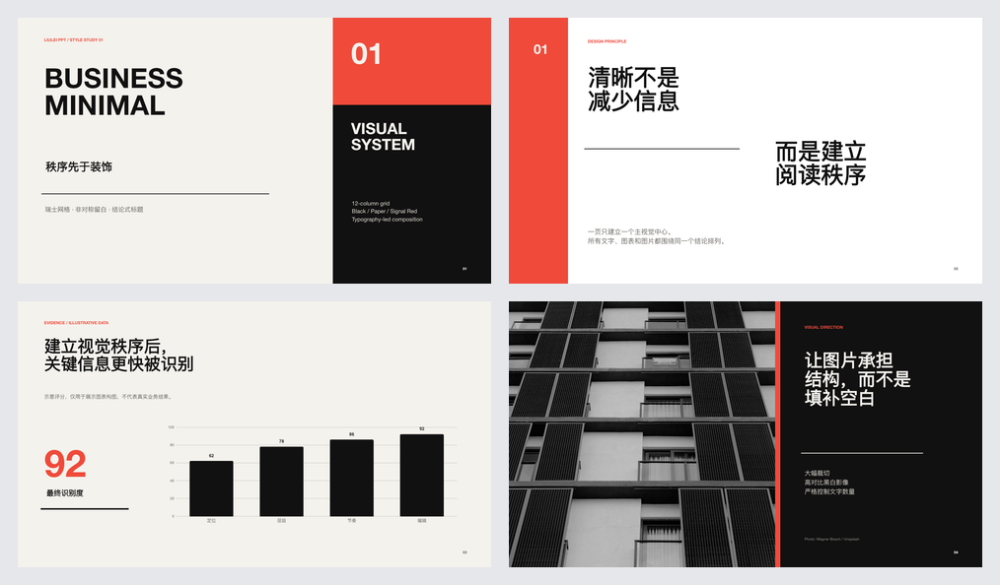
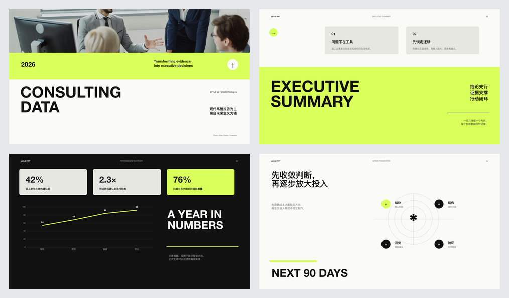
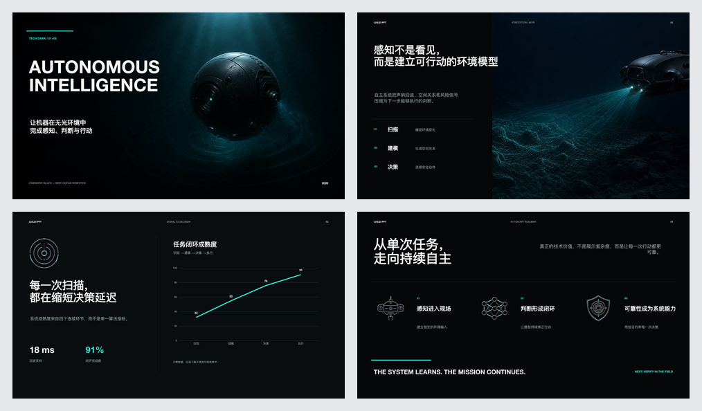
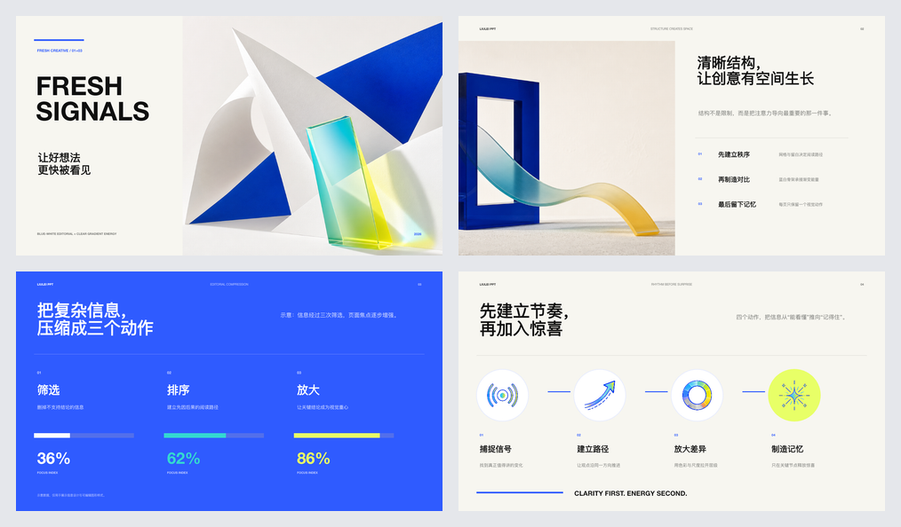

# LIULEI PPT

LIULEI PPT 是一个面向 Codex 的演示文稿 Skill：先梳理沟通目标和逐页叙事，再用六套经过定稿的视觉系统，把文字、文档、表格、图片或参考 PPTX 转换为经过渲染检查、可继续编辑的 `.pptx`。

它适合业务汇报、方案提案、数据分析、技术宣讲、研究报告、品牌叙事等场景。最终交付不是一组静态截图，而是保留可编辑文字、图表、表格以及按需演讲者备注的 PowerPoint 文件。

## 核心能力

- **先叙事、后设计**：先明确受众、目标、核心结论和每页任务，经用户确认大纲后再生成。
- **六套完整视觉系统**：风格不仅是配色，还包括字体层级、网格、媒体尺度、图表处理和页面节奏。
- **三种制作路径**：使用内置风格、严格复用参考模板，或提取参考 PPTX 的设计语言后重新绘制。
- **结构化内容生成**：支持标题页、章节页、观点页、图文页、关键数字、引语、时间线、原生图表和表格等 12 种布局。
- **来源与素材可追溯**：保留来源标识，不虚构事实、数据、人物、引语或结论。
- **生成后再交付**：逐页渲染，检查页数、越界、占位符、版式和整套节奏；视觉检查未通过时不会交付。

## 六套已定稿视觉系统

每套风格都附带配置文件、已定稿样例 PPTX 和预览拼图。实际制作前，Codex 会展示这些预览供选择。

| 风格 | 适用方向 | 已定稿预览 |
| --- | --- | --- |
| **商务极简** `business-minimal` | 管理层汇报、商业提案、通用商务 |  |
| **咨询数据** `consulting-data` | 分析、建议和数据密集型决策 |  |
| **科技深色** `tech-dark` | 科技、AI、产品与工程叙事 |  |
| **清新创意** `fresh-creative` | 品牌、营销、工作坊与创意表达 |  |
| **学术报告** `academic-report` | 研究、教育和正式报告 |  |
| **高端杂志** `editorial-premium` | 思想领导力、发布会和高端叙事 |  |

## 工作方式

1. **理解任务**：读取材料，确认受众、用途、语言、比例、页数和输出位置。
2. **选择路径与风格**：无参考稿时展示六套内置风格；有参考 PPTX 时选择严格模板复用或风格提取重绘。
3. **提交逐页大纲**：每页列出结论式标题、叙事角色、内容证据、布局、视觉方向和来源。
4. **等待确认**：只有收到明确批准，或用户明确要求跳过批准，才开始制作。
5. **生成与验证**：构建可编辑 PPTX，渲染所有页面，完成自动检查和视觉检查后再交付。

## 快速开始

发布验证环境为 Codex CLI `0.144.6`、Node.js `v20.20.0` 和 Git `2.42.0`。这些是已验证版本，不代表对更低版本作出兼容性承诺。生成脚本还需要 Codex primary runtime 中的 `@oai/artifact-tool`、`sharp` 与 `lucide`；仓库本身不需要运行 `npm install`。

把仓库克隆到 Codex 的 skills 目录：

```bash
CODEX_SKILLS_DIR="${CODEX_HOME:-$HOME/.codex}/skills"
mkdir -p "$CODEX_SKILLS_DIR"
git clone https://github.com/LIULEI0118/liulei-ppt.git "$CODEX_SKILLS_DIR/liulei-ppt"
```

安装后，在下一轮或新建 Codex 任务中明确调用 Skill：

```text
使用 $liulei-ppt，把本目录的 brief.md 制作成 10 页中文业务汇报。
先展示六套风格预览，等我选定风格后给出逐页大纲；未经确认不要生成 PPTX。
最终文件保存到 outputs/quarterly-review.pptx。
```

也可以从 Codex CLI 直接开始：

```bash
codex -C /absolute/path/to/materials \
  '$liulei-ppt 把 brief.md 制作成 10 页中文汇报；先展示风格并等待我确认逐页大纲。'
```

安装、输入材料和首次使用的完整说明见 [快速开始指南](./docs/getting-started.md)。

## 支持的输入与输出

| 输入 | 处理方式 |
| --- | --- |
| TXT、Markdown | 直接读取并梳理叙事 |
| DOCX、PDF | 使用对应的文档/PDF 能力读取完整材料 |
| XLSX、CSV | 先核算与整理数据，再设计原生可编辑图表或表格 |
| PNG、JPG、WebP | 检查后作为经确认的视觉素材使用 |
| PPTX | 检查完整演示稿后，严格复用模板或提取风格重绘 |

默认输出为 16:9 的可编辑 `.pptx`；未指定页数时通常建议 8–12 页。若未给输出路径，Skill 使用当前工作目录下的 `outputs/<topic-slug>.pptx`，并始终保留原始输入文件。

## 文档导航

- [安装与首次使用](./docs/getting-started.md)
- [三种工作流](./docs/workflows.md)
- [命令参考](./docs/command-reference.md)
- [故障排查](./docs/troubleshooting.md)
- [Skill 执行规范](./SKILL.md)
- [贡献指南](./CONTRIBUTING.md)

## 许可证

本项目以 [MIT License](./LICENSE) 发布。
